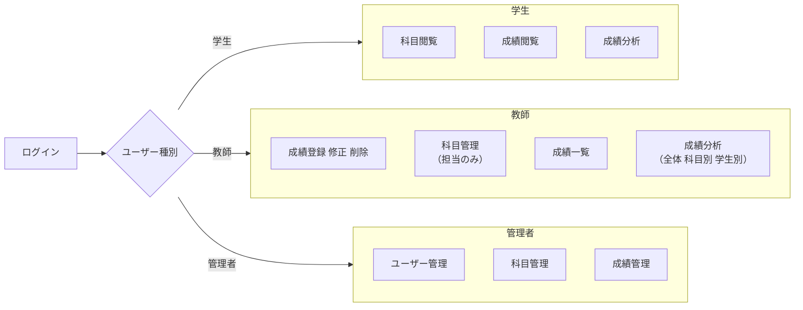
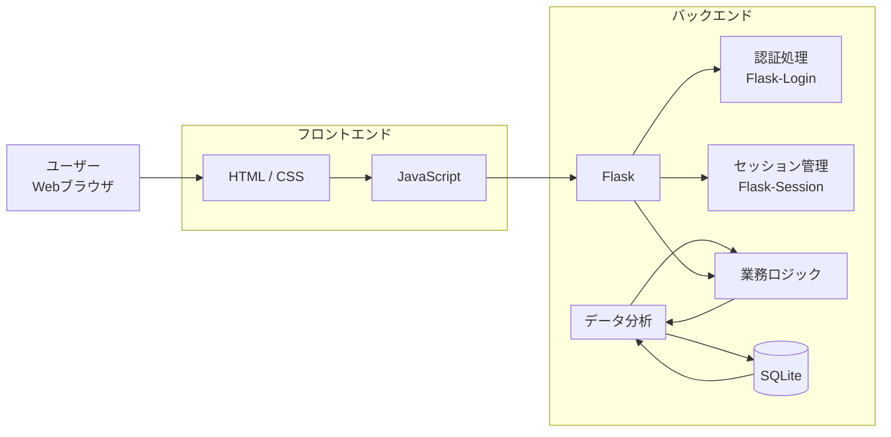

# アプリ名 
**学生管理システム**
# 概要
このアプリケーションは、学生の**成績管理/成績分析を目的としたWebアプリケーション**である。<br>
ログイン機能を基盤とし、<br>
**成績・科目・ユーザー情報の管理、成績の統計分析、可視化と未来の成績予測**までを行うことができる。

# 機能概要
- [ログイン機能](#-ログイン機能)
- [ユーザー管理機能](#-ユーザー管理機能)
- [科目管理機能](#-科目管理機能)
- [成績管理・分析機能](#-成績管理分析機能)
- [ユーザー権限](#ユーザー権限)

## 🔐 ログイン機能
- ユーザーID・パスワードによるログイン
- ユーザー種別（学生 / 教師 / スーパーユーザーを選択してログイン）
- ログイン成功・失敗時の画面制御
- ログアウト処理
- セッション管理（ログイン状態の保持）
- 不正入力時のエラーメッセージ表示


## 👤 ユーザー管理機能
- ユーザー情報の登録 / 修正 / 削除
- ユーザー一覧表示
- 名前・IDによる検索
- ユーザー権限（学生 / 教師）の管理
- 権限に応じた閲覧・操作制御
- GPA・科目別評価のグラフ表示


## 📘 科目管理機能
- 科目情報の登録 / 修正 / 削除
- 科目一覧の表示
- 専攻・学年・曜日による検索
- 学生の選科（科目登録）
- 学生が登録した科目の削除（教師権限）
- 科目と担当教師の管理


## 📊 成績管理・分析機能
- 成績情報の登録 / 修正 / 削除（教師）
- 学籍番号・科目名による成績検索
- 学生ごとの成績一覧表示
- 平均点・最高点・最低点の算出
- 全体成績の統計処理
- 得意科目・苦手科目の分析
- 未来の成績予測
- グラフ・表形式での成績可視化

## ユーザー権限

### 学生
- 科目/教師の閲覧
- 履修登録
- 自分の成績情報の閲覧
- 成績分析

### 教師
- 学生の成績情報の登録・修正・削除
- 学生が登録した科目から履修取り消し
- 科目管理（担当のみ）
- 成績分析（全体/科目別/学生別）

### スーパーユーザー
- 全ユーザー情報の管理
- 全成績情報の管理
- 全科目情報の管理

# アプリケーション構成

### システム構成


## 使用技術
- Python 3.13.7
- Flask
- SQLite + peewee
- HTML / CSS / JavaScript

## 動作条件
```bash
python 3.13.7

Flask==3.1.2
peewee==3.18.3
```

## 使い方
1. リポジトリをクローン。
```bash
git clone https://github.com/OOP2-2025-final-G03/StudentManagementSystem.git
cd StudentManagementSystem
```
2. 必要なライブラリをインストール。
```bash
pip install -r requirement.txt
```

3. アプリケーションを起動。
```bash
python main.py
```

4. ブラウザでアプリケーションにアクセス。
```
http://localhost:8000/
```
