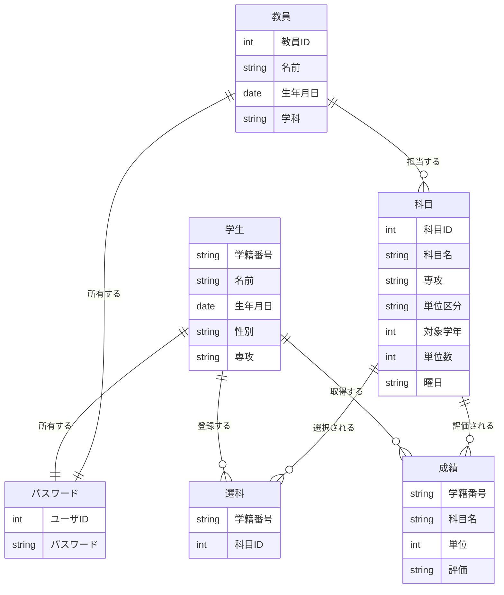
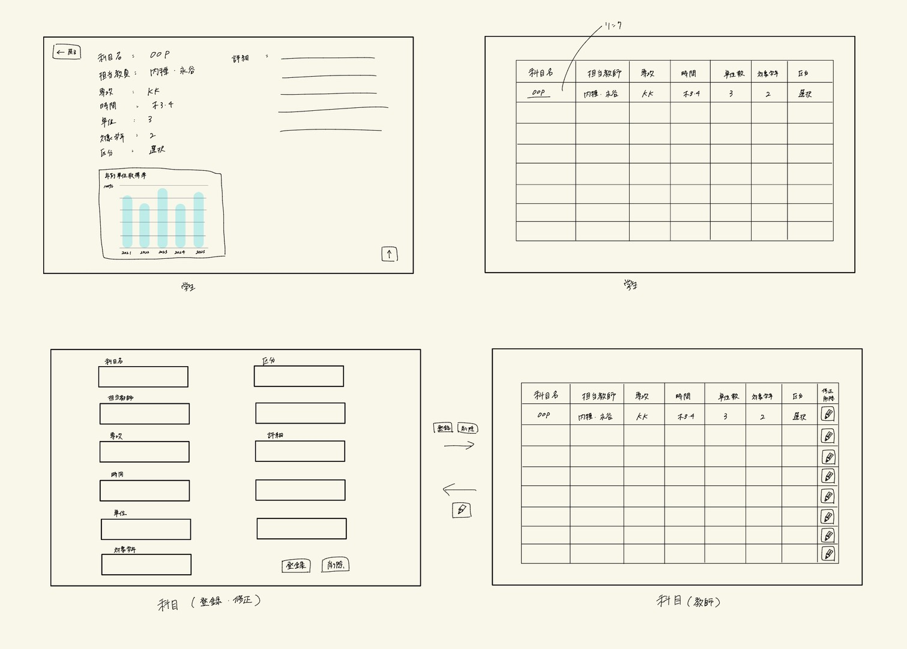

# 最終課題
## 学生管理システム

### チームメンバー

- k24019 [@taku3](https://github.com/taku3mi)
- k24039 [@Alicia4771](https://github.com/Alicia4771)
- k24056 [@ta-nu-13](https://github.com/ta-nu-13)
- k24100 [@kousuke361](https://github.com/kousuke361)
- k24103 [@conFess233](https://github.com/conFess233)

### 使用するもの
- Flask
- SQLite

### データベース
- 学生情報（学籍番号、名前、生年月日、性別、専攻）
- 教員情報（教員ID、名前、年齢、学科）
- 選科情報（学生のID、登録した科目）
- パスワード情報（ユーザID、パスワード）
- 成績情報（学籍番号、科目名、単位、評価）
- 科目情報（科目ID、科目名、担当教師、専攻、単位区分、対象学年、単位数、曜日）
### ER図



### 機能要件
- ログイン機能（学生、教師共通）
- ユーザー情報の登録、修正、削除、検索
- 成績情報の登録、修正、削除、検索
- 科目情報の登録、修正、削除、検索
- 成績情報の集計（平均点、最高点、最低点）
- 成績情報の可視化（グラフや表形式での表示）
- 未来の成績の予測機能
- 全体/学生ごとの成績分析(得意、苦手など)

#### ユーザー権限
- 学生
    - 科目/ユーザーの一覧を見ることができる
    - 自分の成績を見ることができる
- 教師
    - 学生の成績を編集することができる。
    - 学生が登録した科目から削除できる
- スーパーユーザー
    - 全てのユーザー情報を管理することができる。
    - 全ての成績情報を管理することができる。
    - 全ての科目情報を管理することができる。


### 役割分担
| 役割 | 担当 |
| --- | --- |
| ログイン機能 | [@taku3](https://github.com/taku3mi) |
| 成績情報および成績に関する機能 | [@Alicia4771](https://github.com/Alicia4771) |
| 科目情報および科目に関する機能 | [@ta-nu-13](https://github.com/ta-nu-13) |
| ユーザー情報およびユーザーに関する機能 | [@kousuke361](https://github.com/kousuke361) |

| 役割     | 内容                                                                                                                                   |
| --- | --- |
| ログイン機能 | ユーザーIDとパスワードによるログイン処理<br>ユーザー種別（学生／教師）の判定<br>ログイン成功・失敗時の画面制御<br>ログアウト処理<br>セッション管理（ログイン状態の保持）<br>不正入力時のエラーメッセージ表示 |
| 成績情報および成績に関する機能 | 成績情報の登録（教師）<br>成績情報の修正（教師）<br>成績情報の削除（教師）<br>学籍番号・科目名による成績検索<br>学生ごとの成績一覧表示<br>成績の平均点・最高点・最低点の算出<br>全体成績の統計処理<br>得意科目・苦手科目の分析<br>未来の成績予測処理 |
| 科目情報および科目に関する機能 | 科目情報の登録<br>科目情報の修正<br>科目情報の削除<br>科目一覧の表示<br>専攻・学年・曜日による科目検索<br>学生の選科（科目登録）処理<br>学生が登録した科目の削除（教師権限）<br>科目と担当教師の管理 |
| ユーザー情報およびユーザーに関する機能 | 学生情報の登録・修正・削除（スーパーユーザー）<br>教員情報の登録・修正・削除（スーパーユーザー）<br>ユーザー一覧の表示<br>名前・IDによるユーザー検索<br>ユーザー権限（学生／教師）の管理<br>学生は自分の情報のみ閲覧可能とする制御<br>教師は全ユーザー情報を管理可能とする制御|


### ディレクトリの構造
```
StuMnagerSys/
- main.py
- database.db
- /static
    - /css
        - .cssファイル
    - /js
        - .jsファイル
- /templates
    - .htmlファイル(各ページのHTMLファイル)
- /models
    - .pyファイル(データベースモデルの定義)
- /routes
    - .pyファイル(ルーティングの定義)
...
```

### コードの標準
#### コメント
- docstring: [Google Style](https://sphinxcontrib-napoleon.readthedocs.io/en/latest/example_google.html)（できるだけコメントつけましょう）
使用例
```
def calculate_average(scores: list[int]) -> float:
    """
    成績リストから平均点を計算する関数。

    Args:
        scores (list[int]): 成績のリスト

    Returns:
        float: 平均点
    """
    return sum(scores) / len(scores)
```
#### 命名規則
- 変数名、関数名、メソッド名、ファイル名
    -  [スネークケース (Snake Case)](https://qiita.com/uechi-shingo/items/d8f02ecdd8a535d6868e)
    - 単語をアンダースコア`_`で区切り、すべて小文字とする
使用例
```
student_name = "Tanaka"
total_score = 85

def get_student_score():
    pass
```

- クラス名
    - [パスカルケース](https://qiita.com/munepi0713/items/82ce7a56aa1b8233fd30)を使用する
    - 各単語の先頭を大文字にする
    - アンダースコアは使用しない
使用例
```
class Student:
    pass

class GradeManager:
    pass
```

- 定数
  - 定数は すべて大文字 + スネークケース を使用する
使用例
```
MAX_SCORE = 100
DEFAULT_TIMEOUT = 30
```


### イメージ図
#### 科目情報
